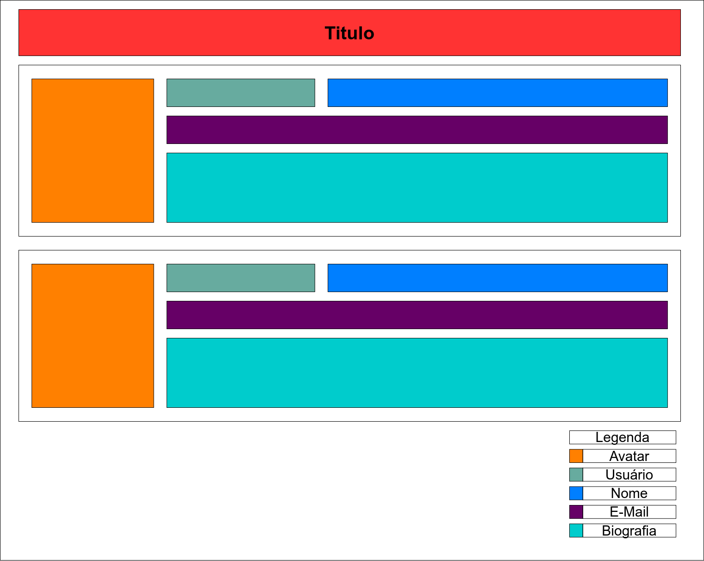

# Quem é a ST IT?

Uma empresa que utiliza o qu​​e há de mais recente em termos de tecnologia de desenvolvimento de softwares e ferramentas de gestão de projetos, através de profissionais certificados e com experiência no mercado.

Trabalhamos em parceria com nossos clientes para oferecer todo suporte necessário, cumprindo prazos e resultados que o mundo corporativo exige.

Inovar no negócio, nas estratégias, na tecnologia, nos processos traz resultados, isso é o que a ST IT Consulting tem realizado juntamente com seus clientes, investir com Inteligência e eficiência.​​

# Porque trabalhar na ST IT?

Somos uma empresa colaborativa, com equipes multidisciplinares, que trabalham bem em equipe, mas com autonomia, somos um empresa formadora de líderes e que tem foco na gestão de pessoas, não apenas gestão técnica

# Sobre a Vaga

Desenvolvedor front-end que esteja iniciando a carreira, que tenha bastante vontade de aprender não só tecnologias de front-end mas sim tecnologias de desenvolvimento no geral.

**Não é necessário experiência** no mercado de trabalho, mas é interessante que a pessoa tenha alguma experiência acadêmica ou de experimentação.

## Requisitos

Conhecimento mesmo que superficial nas seguintes tecnologias:
- HTML
- CSS
- Javascript
- NodeJS
- ReactJS
- React Native

# O Desafio

Você terá que criar uma SPA (Single Page Application) que deve consumir os dados de uma API e mostrar o resultado na tela respeitando um layout

Essa aplicação deve mostrar de uma forma amigável os membros do repositório do Github da AWS, as informações que julgamos necessárias são: login, avatar, nome e biografia.

Fique a vontade para definir o padrão de cores a ser utilizada, a única exigencia e que respeite o layout abaixo em uma tela de desktop, o layout em telas menores como smart fones pode ser redesenhado contanto que fique de forma fácil a visualização das informações.

**Ex. Layout**

## Detalhes sobre o projeto

A base do projeto está em ReactJS, só foi criado a estrutura inicial, pode ficar a vontade para ajustar o que julgar necessário, se achar necessários pode instalar bibliotecas de terceiros.

Link da api para membros do repositório da AWS: https://api.github.com/orgs/aws/members    

Link para acesso do perfil de um membro do Github: https://api.github.com/users/:usergithub

### Como realizar o teste?
Faça um fork desse projeto contento a estrutura inicial, e desenvolva a partir dela, use as bibliotecas que julgar necessárias, mas seria interessante se não usar frameworks de CSS (Cascade Style Sheet).

### Como devo entregar o projeto?
Para entregar suba o projeto em seu próprio Github em um repositório separado, que seja publico e envie o link para seu contato no RH.

